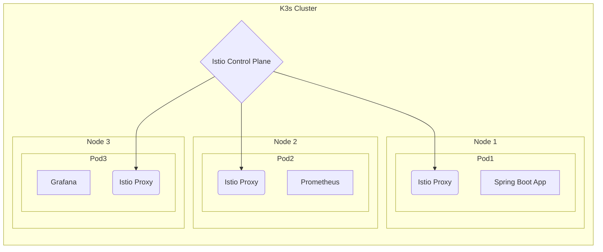

### 목표

Spring Boot, JPA, PostgreSQL 기반 웹 프로젝트를 k3s 클러스터에서 동작하게하고,

Prometheus와 Grafana를 사용하여 리소스 모니터링을 구현하는 것.

### 설계

```mermaid
graph LR
    subgraph K3s Cluster
        istioControlPlane{Istio Control Plane}
        subgraph Node 1
            subgraph Pod1
                spring1[Spring Boot App]
                istioProxy1(Istio Proxy)
            end
        end
        subgraph Node 2
            subgraph Pod2
                prometheus[Prometheus]
                istioProxy2(Istio Proxy)
            end
        end
        subgraph Node 3
            subgraph Pod3
                Grafana[Grafana]
                istioProxy3(Istio Proxy)
            end
        end
        istioControlPlane --> istioProxy1
        istioControlPlane --> istioProxy2
        istioControlPlane --> istioProxy3
    end

```

### tools

Spring boot.
Prometheus.
Grafama.
K3s.
Istio.
