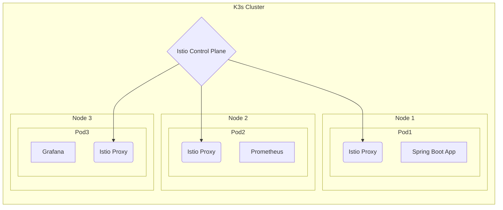

## Spring Boot, JPA, PostgreSQL with Prometheus, Grafana and Istio on K3s

    

### 목표

Spring Boot, JPA, PostgreSQL 기반 웹 프로젝트를 k3s 클러스터에서 동작하게하고,

Prometheus와 Grafana를 사용하여 리소스 모니터링을 구현하는 것.

### 설계

### tools

Spring boot.
Prometheus.
Grafama.
K3s.
Istio.
